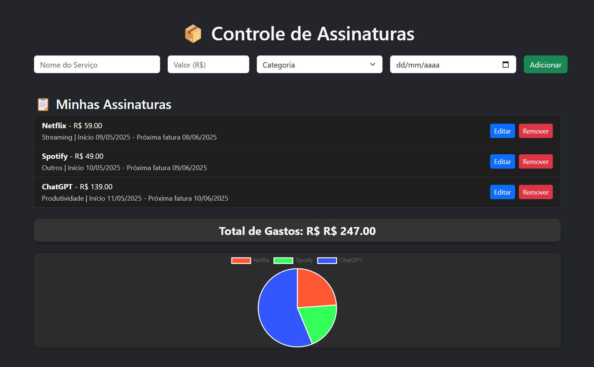
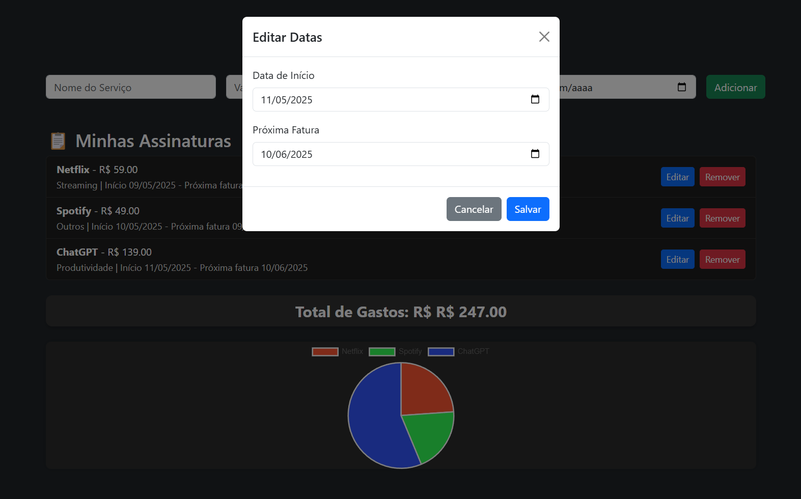

# 📦 Controle de Assinaturas

Sistema desenvolvido para gerenciar e visualizar assinaturas de serviços (streaming, produtividade, educação, etc.), com foco em controle financeiro pessoal, design moderno em modo escuro e gráficos interativos.

---

## 🧾 Descrição Geral

Este sistema permite ao usuário registrar assinaturas recorrentes, visualizar os gastos mensais e editar informações de forma prática. O projeto utiliza **tecnologias web modernas**, armazena os dados localmente no navegador e apresenta um **gráfico interativo** com o resumo das despesas.

---

## 📌 Funcionalidades Principais

- ✅ Cadastro de serviços com nome, valor, categoria e data de início
- ✅ Cálculo automático da **próxima fatura** (30 dias após início)
- ✅ Lista visual das assinaturas com detalhes
- ✅ Edição de datas através de modal
- ✅ Remoção de assinaturas
- ✅ Cálculo e exibição do **total de gastos**
- ✅ Geração de gráfico tipo pizza com **distribuição de despesas**
- ✅ Armazenamento local usando `localStorage`

---

## 💻 Tecnologias Utilizadas

- **HTML5** – Estrutura semântica da página
- **CSS3** + **Bootstrap 5.3** – Estilização moderna em modo dark e responsividade
- **JavaScript** – Manipulação da DOM, eventos e armazenamento
- **Chart.js** – Biblioteca para exibição do gráfico em pizza

---

## 📊 Gráfico Interativo

O sistema usa o `Chart.js` para gerar um **gráfico em pizza** com os valores de cada assinatura, permitindo ao usuário ter uma **visualização imediata da distribuição dos gastos**.

- O gráfico é recriado automaticamente a cada modificação (adição, edição ou exclusão).
- Cores distintas são atribuídas dinamicamente a cada serviço.

---

## 🧠 Armazenamento Local

Todos os dados são armazenados no `localStorage` do navegador, garantindo persistência mesmo após o fechamento da aba ou recarregamento da página.

> Nenhuma informação é enviada para servidores externos.

---

## ▶️ Como Utilizar

1. **Abra o arquivo `index.html` em seu navegador.**
2. Preencha o formulário com:
   - Nome do serviço
   - Valor da mensalidade
   - Categoria
   - Data de início
3. Clique em **"Adicionar"** para registrar a assinatura.
4. Utilize os botões "Editar" ou "Remover" conforme necessário.
5. Veja o gráfico e o total de gastos sendo atualizados em tempo real.

---

## 🖼️ Visual

- Design moderno em **modo escuro**
- Itens organizados em listas com categorias
- Campos de entrada intuitivos
- Estilização com Bootstrap e customização com CSS

### Imagens:

- **Tela Principal:**

  

- **Modal de Edição:**

  

---

## 📄 Licença

Este projeto é de código aberto, disponível sob a licença MIT. Você pode utilizar, modificar e redistribuir conforme desejar.

---

## 🙋 Autor

**Rennan Rentz**  
[LinkedIn](https://www.linkedin.com/in/rennan-rentz) | [GitHub](https://github.com/rennanrentz)  
Email: rennanrentz@gmail.com
Desenvolvedor web focado em soluções práticas e funcionais, com expertise em HTML, CSS, JavaScript e frameworks modernos. Em busca de novas oportunidades e projetos desafiadores.

---

